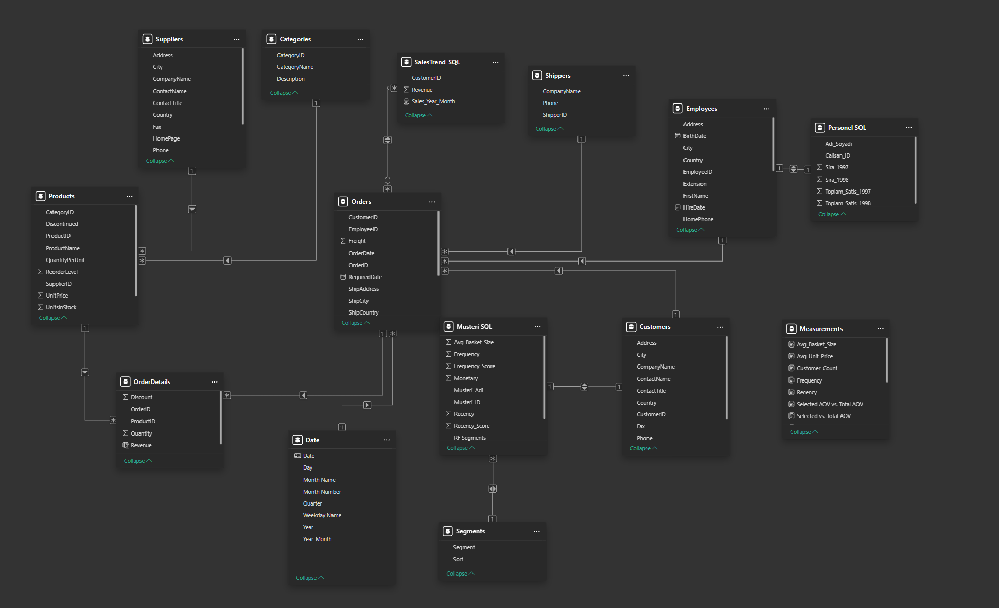

# M2M Analytics | Sales, Supply Chain, CRM & Employee Performance

## Overview

M2M Analytics is an end-to-end business intelligence project built on the Northwind database. The analysis covers product revenue and supplier risk, employee sales performance with 1999 forecasting, and customer segmentation using RFM methodology — delivered through a multi-page Power BI dashboard and a structured T-SQL query set.

**Total Revenue: €1.27M | 830 Transactions | €1.53K Avg. Order Value | 91 Customers**

---

## Problem Statement

The business needed a unified view across four domains — products, customers, employees, and supply chain — to identify revenue concentration risks, standardise high-performing sales behaviours, and develop differentiated customer strategies based on purchasing patterns.

---

## Data Source

- **Database:** Northwind (Microsoft sample database)
- **Tables used:** Orders, OrderDetails, Products, Categories, Suppliers, Customers, Employees, Shippers
- **Analysis period:** July 1996 – May 1998
- **SQL environment:** T-SQL (Microsoft SQL Server)

---

## Data Model

The Power BI data model integrates the Northwind relational tables with additional SQL query outputs imported as separate tables:

| Table | Description |
|-------|-------------|
| `Orders` | Core transaction table |
| `OrderDetails` | Line-level revenue calculations |
| `Products` | Product catalogue with pricing |
| `Suppliers` | Supplier information |
| `Categories` | Product category mapping |
| `Customers` | Customer master data |
| `Employees` | Sales team data |
| `Date` | Custom date table (Year, Quarter, Month, Weekday) |
| `Musteri SQL` | SQL query output — top 5 customer RFM analysis |
| `Personel SQL` | SQL query output — employee performance 1997/1998 |
| `SalesTrend_SQL` | SQL query output — monthly revenue trend |
| `Segments` | RF segment labels (Champions, Loyal, Growth, At Risk, Dormant) |
| `Measurements` | DAX measure table |

---

## SQL Analysis — 3 Business Questions

### Question 1: Top 5 Revenue-Generating Products & Supplier Risk
- Identified top 5 products by revenue using `(UnitPrice × Quantity) × (1 − Discount)`
- Analysed single-supplier dependency per product
- Proposed alternative suppliers at category level (database has one supplier per product — category-level comparison applied)
- **Key risk:** A single-supplier structure exists for the highest-revenue products, increasing operational risk exposure

### Question 2: Employee Performance — 1997 vs. 1998 & 1999 Forecast
- Identified top 5 employees by revenue in both 1997 and 1998
- Applied **annualisation** to 1998 data (data available only for 5 months → scaled ×12/5)
- Used `ROW_NUMBER()` with `PARTITION BY` year for ranking
- Used **conditional aggregation** (`MAX + CASE`) to pivot year rows into columns
- Calculated year-on-year growth rate per employee
- Projected 1999 performance assuming same growth trajectory
- **Finding:** The top 5 performers remained the same across both years, though rankings shifted

### Question 3: Top 5 Customers — RFM Analysis & Campaign Strategy
- Identified top 5 customers by revenue over the last 2 years (analysis date: 01.06.1998)
- Calculated: **Recency** (days since last order), **Frequency** (distinct order count), **Monetary** (total revenue), **Average Basket Size**
- Used `DATEDIFF`, `COUNT(DISTINCT)`, and conditional null/zero guards for division safety
- Results fed into Power BI for RF segmentation and campaign targeting

---

## Dashboard Structure

| Page | Description |
|------|-------------|
| **Overview** | Revenue by category, sales trends, geographic map, top products & customers |
| **Products** | Product revenue ranking, supplier analysis, price-quantity-revenue scatter |
| **Customers** | RF segmentation (Champions/Loyal/Growth/At Risk/Dormant), RFM bubble chart |
| **Employees** | Revenue ranking, 1998 annualised vs. 1997 actual comparison chart |

---

## Key Findings

- **Top 5 products = 31% of total revenue** — high concentration risk
- **Single-supplier dependency** on highest-revenue product lines — alternative sourcing recommended
- **Top 5 customers = 33% of total revenue** (QUICK-Stop €110K, Ernst Handel €105K, Save-a-lot Markets €104K)
- **Top 5 employees consistent** across 1997–1998; top performer (Margaret Peacock) projected at €232K annualised in 1998
- **Beverages** is the highest revenue category at €267K, followed by Dairy Products at €234K
- Revenue trend shows strong growth through mid-1997, with seasonal fluctuation into 1998

---

## Business Recommendations

**Supply Chain**
A single-supplier structure exists for products carrying a significant share of revenue. Alternative suppliers in the same categories should be identified and secondary supply sources established for critical product lines.

**Sales Performance**
The top 5 performers remained the same in 1997 and 1998, though rankings shifted. To support the growth projected in the 1999 scenario, the sales approaches of the highest-performing employees should be standardised across the entire team.

**Customer Strategy**
The order patterns of the top 5 revenue-generating customers have been analysed using RFM scores and average basket sizes. Differentiated campaign strategies should be applied based on segment values to develop purchasing behaviour in the desired direction and increase revenue.

---

## Technical Highlights

**T-SQL**
- Multi-level subqueries and CTEs
- `ROW_NUMBER()` with `PARTITION BY` for annual ranking
- Conditional aggregation (`MAX + CASE`) for pivoting year-based rows to columns
- Revenue annualisation for partial-year data (1998: ×12/5)
- Null and zero guards on all division operations
- `DATEDIFF` for RFM recency and tenure calculations

**Power BI**
- Star schema data model with 13 tables
- Custom Date table with Year, Quarter, Month, Weekday dimensions
- DAX measures: dynamic revenue share, selected vs. total AOV, RF scoring
- RF segmentation using quantile thresholds (Recency + Frequency scores)
- Interactive filtering across all pages (Year, Category, Country, Customer, Supplier)

---

## Dashboard Preview

---

## Files

| File | Description |
|------|-------------|
| `M2M_Analytics.sql` | T-SQL queries for all 3 business questions |
| `M2M_Analytics.xlsx` | Analysis output and summary tables |
| `M2M_Analytics.pbix` | Power BI dashboard (see download link below) |

## Download

| File | Link |
|------|------|
| `M2M_Analytics.pbix` | [Download from Google Drive](https://drive.google.com/file/d/1tyaZKBPhijqsRMkWYMq58me5-LYv_6VJ/view?usp=sharing) |
| Dashboard Walkthrough Video | [Watch on Google Drive](https://drive.google.com/file/d/1K6QGs04dz7y6u-9_KJa0v5T_KTvnFe83/view?usp=sharing) |

> Power BI Desktop required to open .pbix files. [Download Power BI Desktop](https://powerbi.microsoft.com/desktop)

---

## Tools & Technologies

- **T-SQL** — Microsoft SQL Server
- **Power BI Desktop** — dashboard, DAX, data modelling
- **Excel** — output tables and summary analysis
